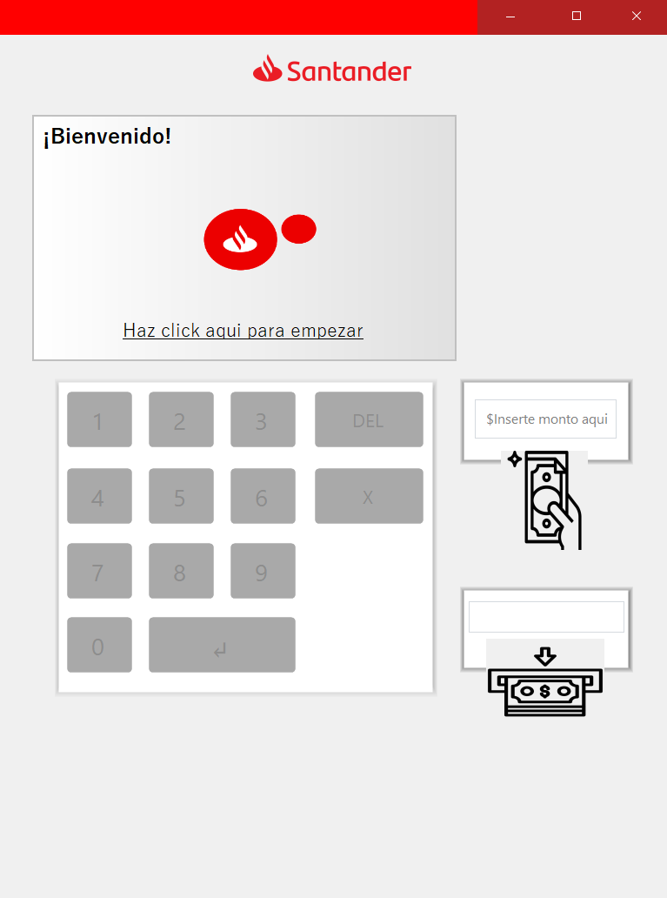

# CajeroAutomatico

A desktop ATM (Automated Teller Machine) simulation built with C# and Windows Forms. This project was developed as a learning exercise focused on Object-Oriented Programming (OOP), modular design, and clean code principles, while also serving as a realistic banking system simulation.

## Overview

CajeroAutomatico emulates the core functionality of a real-world ATM. It allows users to authenticate using a PIN and perform common banking operations such as withdrawing and depositing money, as well as checking account balances.

This project was created for academic purposes, personal practice, and as part of a professional portfolio.

## Features

* User authentication via PIN
* Withdraw money
* Deposit money
* Check account balance
* Error handling:

  * Insufficient funds
  * Incorrect PIN

## Tech Stack

* Language: C#
* Framework: .NET 7
* UI: Windows Forms
* Database: Microsoft Access

## Architecture

The application follows a class-based structure with separation of responsibilities:

* Account management
* ATM operations
* Transaction handling

While it does not implement formal architectural patterns like MVC or layered architecture, the codebase is organized with modularity and readability in mind.

## Getting Started

### Prerequisites

* Visual Studio (recommended)
* .NET 7 SDK
* Microsoft Access (for database support)

### Installation & Run

1. Clone the repository:

   ```bash
   git clone https://github.com/richglez/CajeroAutomatico.git
   ```

2. Open the solution in Visual Studio.

3. Restore dependencies (if prompted).

4. Run the project:

   * Press `F5` or click **Start** in Visual Studio.

> Note: If the database file is not properly linked, you may need to update the connection string to match your local environment.

## Screenshots



## Future Improvements

* Refactor to MVC architecture
* Introduce layered architecture (Services, Repositories)
* Improve UI/UX with a modern design
* Add transaction history
* Implement unit testing
* Enhance security (e.g., PIN encryption)
* Migrate database to a more robust system (e.g., SQL Server)

## Use Cases

This project is suitable for:

* Learning and practicing OOP in C#
* Understanding basic banking system logic
* Academic assignments
* Portfolio demonstration

## Contributing

Contributions are welcome. Feel free to fork the repository and submit a pull request.

## License

This project is open-source and available under the MIT License.

## Author

Developed by [richglez]

---

If you found this project useful, consider giving it a star.
